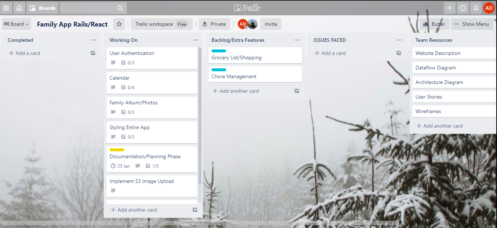
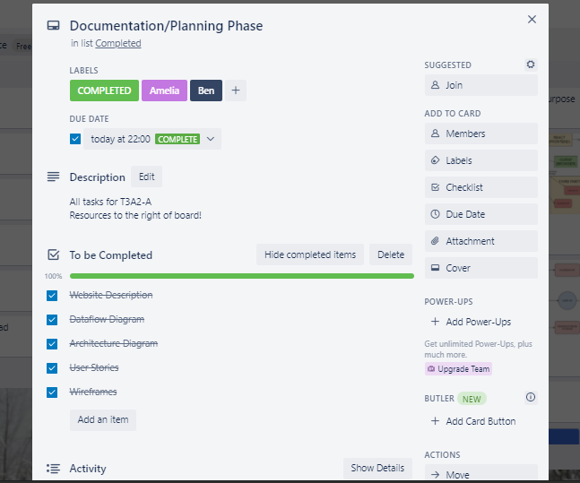
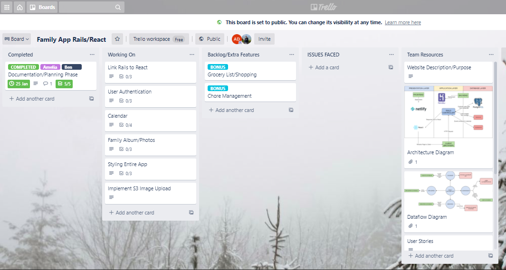
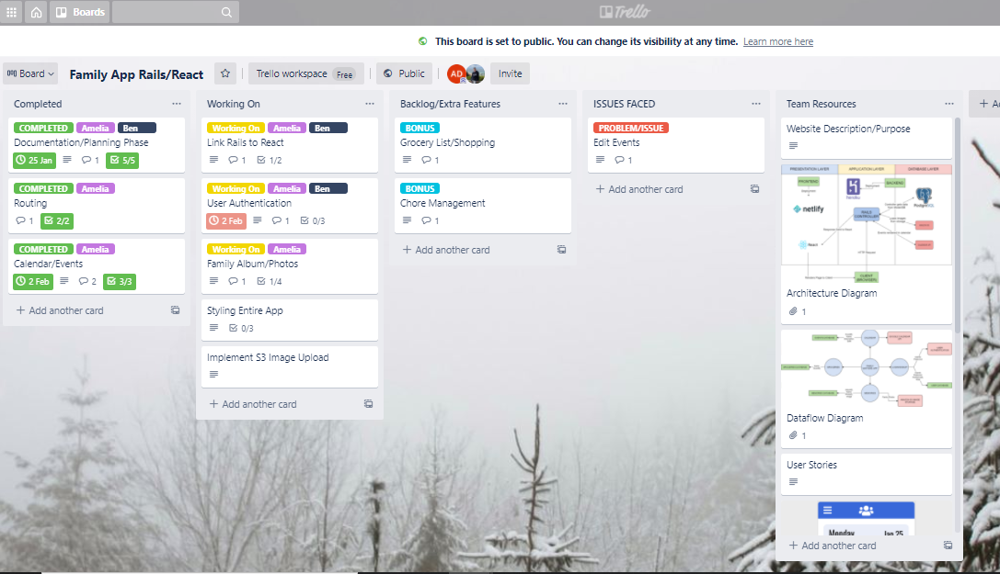
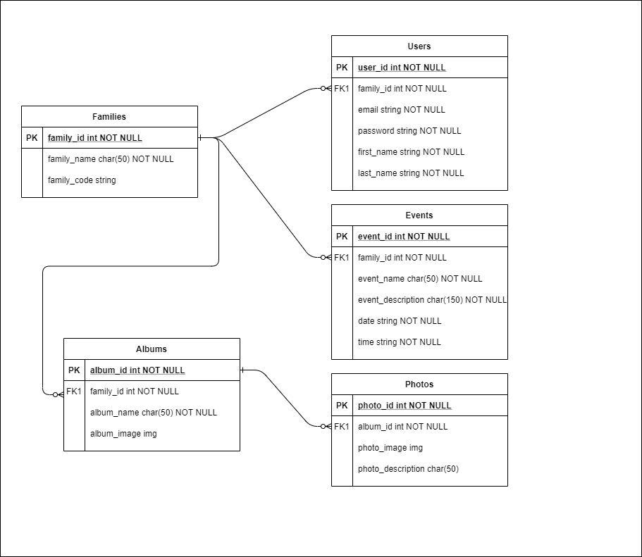

[Trello Board](https://trello.com/b/7JUFHUsE/family-app-rails-react)

[Manual Testing](https://docs.google.com/spreadsheets/d/e/2PACX-1vR-MRHSKj76wpLnlKsQpdOXbStY9fusDuxciPw7fjHnqDjx6TrAdUiOqa8HKAj9BbU0jEVlv7h5u28Q/pubhtml)

## Libraries Used

### Create React App

Create-React-App is a CLI tool that requires no building configuration. In fact, it facilitates the generation of your own boilerplate and lets you initiate the app building process smoothly. You need only one build dependency, and thus, no more complexities are involved. More suitable for simple web apps, this CLI tool has underlayers of Webpack Babel, EsLint, etc.

### React Router

React Router, a group of navigational components synchronizes the components of the UI with browsers address. This makes it effortless to handle navigation in SPA.

Additionally, it offers vivid nesting support, stable screen-to-screen transitions, and server-side rendering.

### Styled Components

Styled Components is a CSS tool that helps you organize your React project (TIP: it works with React Native too). This library helps you build small, reusable components responsible for the look of your app. With traditional CSS you may face the problem of accidentally overwriting selectors used in other places of the site, but thanks to Style Components you can avoid this issue by using a CSS syntax directly inside your components.

## R1: Description of your website

**Purpose**

With each new generation becoming more and more tech savvy and being familiar with using phones/computers, there is a need for new and improved platforms to cater to these families. This platform is designed for families to be able to more efficiently manage their day to day lives. Gone are the days of manually writing entries or events in diaries or on a physical calendar. 'Family Matters' provides families with a way to track everything in one simple application. Families can log events in a virtual calendar, upload and store their treasured memories via family photos and videos, or even manage grocery shopping and chores lists for children.

**Functionality/Features**

- User Authentication, to ensure only verified users can login or sign up to a new family
- Fully functioning calendar, that members can add events to
- Google Calendar API, to send email notifications of upcoming events (OPTIONAL, based on time)
- Image Upload, for users to add photos to the family album
- Multiple animations (CSS) and events (JS) to make the app seem more inviting and stimulating
- Editable grocery list, that family members can add to, edit and delete
- Chore management system, to see what needs to be done for the week (OPTIONAL, based on time)

**Target Audience**

On a professional standpoint, there has been a demand for Family apps over the last few years. This app is designed to meet those needs for families that are after a better way of managing things around the house. Whether it be appointments, children's chores, grocery lists, family photos and more. The way the app will be designed will allow for edits and tweaks that can enable it to be built into other variations to meet the needs of the client.

On a personal standpoint the target audience is for future employers to see what we can do as junior full stack developers. Demonstrating what we are capable of and what our time at Coder Academy has taught us will prove that we are ready to join the workforce.

**Tech Stack**

Front End:

- JSX
- CSS
- JavaScript
- React Framework
- Netlify as deployment platform

Back End:

- Ruby Language
- Ruby on Rails Framework
- PostgreSQL as the database
- Heroku as deployment platform
- AWS - S3
- Google Calendar API

## R2: Dataflow Diagram

## R3: Application Architecture Diagram

## R4: User Stories

- As a new user, I want to sign up so that I can create an account for my family, or join my family's account
- As a family member I want to log a new event in the calendar so that all my family can see when it is
- As a family member I want to add new photos to an album so all my family can view our memories
- As a family member I want to add to and edit our grocery list so that my family knows what we need when someone goes shopping next
- As a child using the app I want to be able to check off completed chores so that my parents have seen that I've completed them
- As a parent I want to be able to see what chores my children have completed so that I know whether to give them their pocket money

## R5: Wireframes for multiple standard screen sizes, created using industry standard software

## R6: Screenshots of your Trello board throughout the duration of the project

1. Trello Board created with cards added across to demonstrate features, deadline of documentation and various checklists

2. Example card use

- Can see who worked on the feature
- Checklists implemented to show stages of completion etc
- Team deadlines set (mimic sprints)

3. Documentation (Part A) completed and coding commenced

4. Substantial Progress Made

## ERD Diagram

